Flights at ABIA: Overachieving planes
=====================================

It makes sense that the departure and arrival delays of a flight are
correlated, since a plane that takes off late is behind schedule and
will typically land late. But are there certain planes that can make up
that gap?

Let's see if any planes have significantly different average departure
and arrival delays. We'll also calculate some summary stats in case we
need them later.

    planes <- dat %>% group_by(TailNum) %>% summarise(
      # two-sample Student's t-test for difference in means of departure delay and arrival delay
      pval=ifelse(length(DepDelay)>2&length(ArrDelay)>2,t.test(DepDelay,ArrDelay)$p.value, NA),
      avg_dep_delay=mean(DepDelay),
      avg_arr_delay=mean(ArrDelay),
      cancelled_ratio=sum(Cancelled==1)/n(),
      diverted_ratio=sum(Diverted==1)/n(),
      n_flights=n(),
      avg_dist=mean(Distance),
      avg_vel=mean(vel),
      std_vel=sd(vel),
      n_uniq_orig=n_distinct(Origin),
      n_uniq_dest=n_distinct(Dest),
      n_uniq_flights=n_distinct(combine(Origin,Dest)),
    # select significant planes at p=0.05 level
    ) %>% filter(pval<=.05&!is.na(pval))
    # separate significantly slow planes from fast ones
    fast_planes <- planes %>% filter(avg_dep_delay>avg_arr_delay)
    slow_planes <- planes %>% filter(avg_dep_delay<avg_arr_delay)
    nrow(fast_planes)

    [1] 96

    nrow(slow_planes)

    [1] 1

    fast_planes %>% select(avg_dep_delay,avg_arr_delay) %>% gather(key="type", value="delay") %>% ggplot(aes(delay, fill=type))+geom_density(alpha=.7, kernel='gaussian')

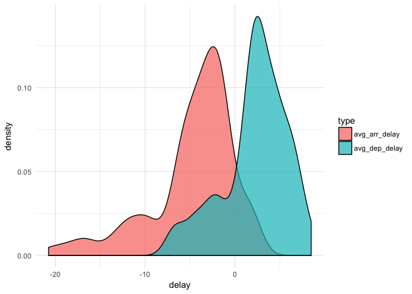

So there are 96 "fast" planes that make up time on average and 1 "slow"
plane that loses time on average. Do the fast planes have anything in
common?

    fast_planes %>% ggplot(aes(avg_vel, avg_dep_delay - avg_arr_delay, color = avg_dist, 
        weight = n_flights, size = n_flights)) + geom_point() + geom_smooth(method = "lm", 
        formula = y ~ x, show.legend = F)

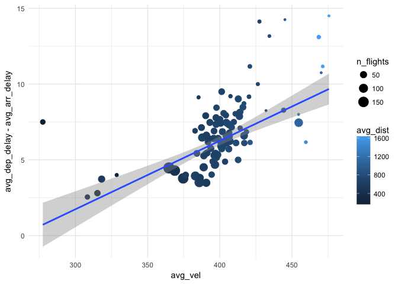

We see that, of our fast planes, the ones that make up the most time
tend to fly faster, further, and less frequently. Maybe this matches the
profile of large jumbo jets ferrying people to and from the coasts
(Austin is about ~1700 miles from either coastline, which is the maximum
average flight distance of these uber-fast fast planes)?

Let's see where the fast planes' tardiness comes from:

    # plot the components of a plane's delay, sorted by number of flights
    fast_planes %>% left_join(dat, by = "TailNum") %>% select(CarrierDelay, WeatherDelay, 
        NASDelay, SecurityDelay, LateAircraftDelay, TailNum, n_flights) %>% na.omit() %>% 
        gather(-TailNum:-n_flights, key = "type", value = "delay") %>% ggplot(aes(reorder(TailNum, 
        n_flights), delay, fill = type)) + geom_col(position = "fill") + coord_flip()

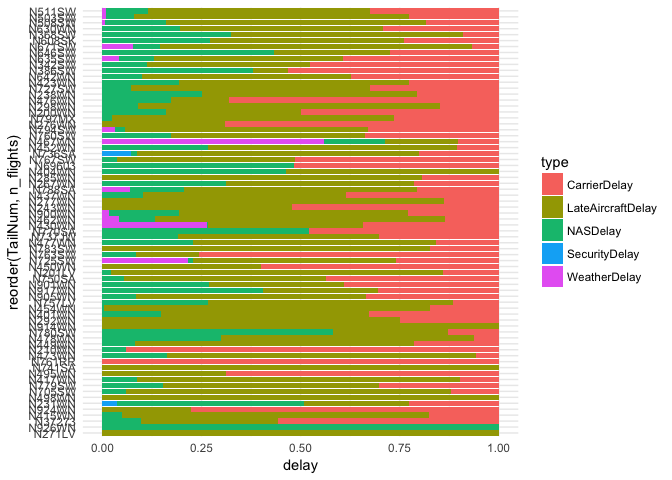

The few planes with weather delays stand out, otherwise it's tough to
say there's any one type of delay that factors in to the planes'
performance. Let's see who operates these fast planes:

    fast_flights <- dat %>% filter(TailNum %in% fast_planes$TailNum)
    fast_flights %>% group_by(UniqueCarrier) %>% summarise(n = n_distinct(TailNum)) %>% 
        left_join(dat %>% group_by(UniqueCarrier) %>% summarise(n = n_distinct(TailNum)), 
            by = "UniqueCarrier") %>% mutate(ratio = n.x/n.y)

    # A tibble: 9 x 4
      UniqueCarrier   n.x   n.y       ratio
             <fctr> <int> <int>       <dbl>
    1            9E     7   152 0.046052632
    2            B6     4   128 0.031250000
    3            CO     2   299 0.006688963
    4            EV     3   107 0.028037383
    5            MQ     3    80 0.037500000
    6            OH     1   131 0.007633588
    7            OO     1   131 0.007633588
    8            UA     2   183 0.010928962
    9            WN    73   549 0.132969035

Interesting — Southwest Airlines owns over 73/96=76% of the fast planes,
and they comprise 13% of its fleet! Let's see which routes all the fast
planes have flown:

    library(ggmap)
    fast_route_summ <- fast_flights %>% group_by(Latitude_org, Longitude_org, Latitude_dest, 
        Longitude_dest) %>% summarise(n_flights = n(), avg_del_change = mean(DepDelay - 
        ArrDelay)) %>% ungroup() %>% mutate(route = row_number())
    # ffu <- fast_flights %>% distinct(Latitude_org, Longitude_org,
    # Latitude_dest, Longitude_dest) %>% left_join(fast_route_summ)
    ffu <- fast_route_summ %>% select(-Latitude_dest:-Longitude_dest) %>% rename(lat = Latitude_org, 
        lng = Longitude_org) %>% bind_rows(rename(select(fast_route_summ, -Latitude_org:-Longitude_org), 
        lat = Latitude_dest, lng = Longitude_dest))

    ggmap(get_map(location = c(left = -124.848974, bottom = 24.396308, right = -66.885444, 
        top = 49.384358))) + geom_point(data = ffu, aes(x = -lng, y = lat, size = n_flights, 
        color = avg_del_change, fill = avg_del_change)) + geom_line(data = ffu, 
        aes(x = -lng, y = lat, group = route, color = avg_del_change))

    converting bounding box to center/zoom specification. (experimental)

    Map from URL : http://maps.googleapis.com/maps/api/staticmap?center=36.890333,-95.867209&zoom=4&size=640x640&scale=2&maptype=terrain&language=en-EN&sensor=false

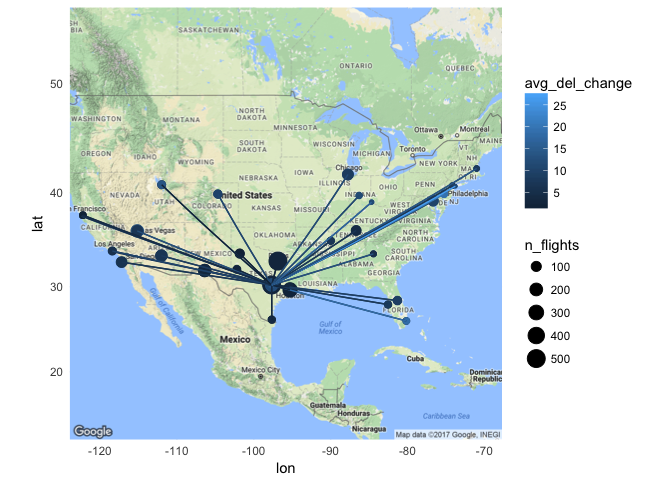

Note that `avg_del_change` = `avg_dep_del-avg_arr_del`. This map looks
right for flights 76% of which are Southwest. It also corroborates our
hypothesis that the longer flights are less frequent but seem also to
make up their delays better.

Let's see how are arrival and departure delays distributed across
carriers?

    dat %>% select(UniqueCarrier, ArrDelay, DepDelay) %>% gather(-UniqueCarrier, 
        key = "delay_type", value = "minutes") %>% ggplot(aes(UniqueCarrier, minutes, 
        fill = delay_type)) + geom_boxplot() + scale_y_log10()

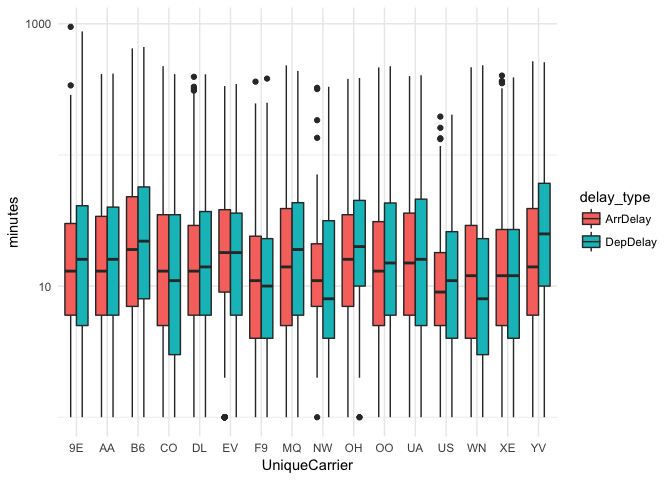
From the above graph we see that YV, B6, OH have the greatest delays.

Seasonal delays are heavily influenced by the weather conditions. So it
would be great to look at weather delays by month to understand which
months to avoid traveling

    dat %>% filter(!is.na(WeatherDelay)) %>% group_by(Month) %>% summarise(avg_weather_del = mean(WeatherDelay), 
        std = sd(WeatherDelay)) %>% mutate(Month = month.abb[Month]) %>% ggplot(aes(Month, 
        avg_weather_del)) + geom_col() + geom_errorbar(aes(ymin = 0, ymax = avg_weather_del + 
        std), width = 0.1)

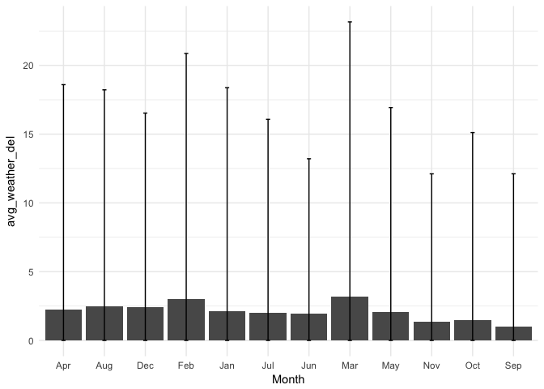

March seems to be the worst to make air travel plans. Is it because of
the destinations? Let's see

    d <- dat %>% filter(!is.na(WeatherDelay)) %>% group_by(Dest, Month) %>% summarise(avg_weather_del = mean(WeatherDelay)) %>% 
        group_by(Dest) %>% filter(avg_weather_del == max(avg_weather_del) & max(avg_weather_del) != 
        0) %>% left_join(codes, by = c(Dest = "locationID")) %>% mutate(Month = month.abb[Month])

    ggmap(get_map(location = c(left = -124.848974, bottom = 24.396308, right = -66.885444, 
        top = 49.384358))) + geom_point(data = d, aes(x = -Longitude, y = Latitude, 
        color = Month, size = avg_weather_del))

    converting bounding box to center/zoom specification. (experimental)

    Map from URL : http://maps.googleapis.com/maps/api/staticmap?center=36.890333,-95.867209&zoom=4&size=640x640&scale=2&maptype=terrain&language=en-EN&sensor=false

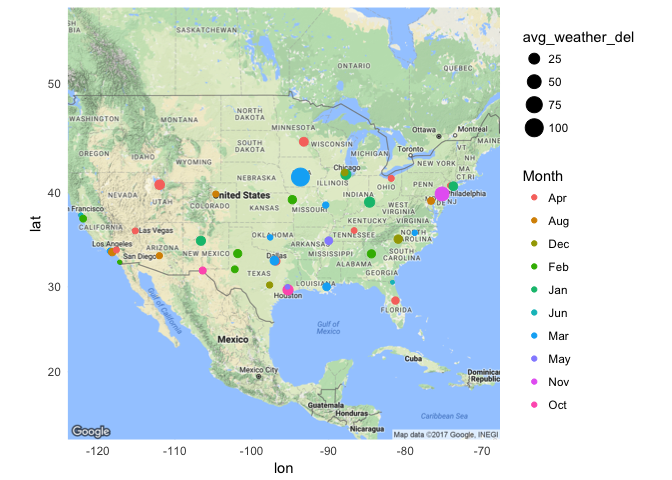

Looks like Iowa is a bad destination in terms of seasonal delays in the
month of march. Must be something to do with the bad weather there in
march.

Problem 2 : Author Prediction
-----------------------------

    suppressMessages(library(tm))
    suppressMessages(library(caret))
    suppressMessages(library(glmnet))
    suppressMessages(library(SnowballC))
    suppressMessages(library(e1071))
    suppressMessages(library(Rgraphviz))
    suppressMessages(library(wordcloud))
    suppressMessages(library(RTextTools))
    suppressMessages(library(ggplot2))
    suppressMessages(library(dplyr))

#### Creating the corpus -

We preprocess the data to remove numbers, remove stopwords, make
everything lowercase, remove punctuation and remove extra white spaces.
We are going to create the document term matrix for both the train and
test together to avoid the possibility of seeing some terms that are
there in the test but not in training and vice versa.

    readerPlain = function(fname) {
        readPlain(elem = list(content = readLines(fname)), id = fname, language = "en")
    }

    authors_train <- Sys.glob("/Users/rakshapai/Downloads/STA380-master/data/ReutersC50/C50train/*")
    file_list_train = NULL
    labels_train = NULL
    authors_test = Sys.glob("/Users/rakshapai/Downloads/STA380-master/data/ReutersC50/C50test/*")
    file_list_test = NULL
    labels_test = NULL

    for (i in authors_train) {
        author_name_train = substring(i, first = 67)
        files_to_add_train = Sys.glob(paste0(i, "/*.txt"))
        file_list_train = append(file_list_train, files_to_add_train)
        labels_train = append(labels_train, rep(author_name_train, length(files_to_add_train)))
    }

    for (i in authors_test) {
        author_name_test = substring(i, first = 66)
        files_to_add_test = Sys.glob(paste0(i, "/*.txt"))
        file_list_test = append(file_list_test, files_to_add_test)
        labels_test = append(labels_test, rep(author_name_test, length(files_to_add_test)))
    }

    file_list <- append(file_list_train, file_list_test)
    labels <- unique(append(labels_train, labels_test))

    all_docs = lapply(file_list, readerPlain)
    names(all_docs) = file_list
    names(all_docs) = sub(".txt", "", names(all_docs))
    all_corpus = Corpus(VectorSource(all_docs))
    # names(all_corpus) = labels

    all_corpus = tm_map(all_corpus, content_transformer(tolower))  # make everything lowercase
    all_corpus = tm_map(all_corpus, content_transformer(removeNumbers))  # remove numbers
    all_corpus = tm_map(all_corpus, content_transformer(removePunctuation))  # remove punctuation
    all_corpus = tm_map(all_corpus, content_transformer(stripWhitespace))  ## remove excess white-space 
    all_corpus = tm_map(all_corpus, content_transformer(removeWords), stopwords("SMART"))  #remove stop words
    all_corpus <- tm_map(all_corpus, stemDocument)  #stemming the document to reduce the words to their word stem

    # creating a document term matrix with tf idf scores
    dtm <- DocumentTermMatrix(all_corpus, control = list(weighting = function(x) weightTfIdf(x, 
        normalize = FALSE)))
    dtm <- removeSparseTerms(dtm, 0.975)

#### Plotting word frequencies

    # without the weights, just the frequency counts
    dtm1 <- DocumentTermMatrix(all_corpus)
    freq <- sort(colSums(as.matrix(dtm1)), decreasing = TRUE)
    wf <- data.frame(word = names(freq), freq = freq)

    ## subset(wf, freq>5000) %>% ggplot(aes(word, frequency)) +
    ## geom_bar(stat='identity',col='red') +
    ## theme(axis.text.x=element_text(angle=45, hjust=1))

    set.seed(142)
    wordcloud(names(freq), freq, min.freq = 2000, colors = brewer.pal(6, "Dark2"))

Here we can see how the words appear across the documents. Are some of
the words are misspelt or is this the way the author has described them?
Some of these questions are fundamental in pre-processing.

#### Model 1 | Multinomial Naive-Bayes

Let now apply multinomial bayes model to the training data set. We
calculate the weight vector for each author - the weight vector is a
weight of each token or word for that author.In order to avoid zero
probabilities for those words that could be in the test set but not in
training set, we use Lidstone smoothing - where the words that are not
in the vocabulary are given a small non-zero probability for the classes
so that the posterior probabilities don't suddenly drop to zero.

    x <- as.matrix(dtm)
    x_train <- x[1:2500, ]
    x_test <- x[2501:5000, ]
    smooth_count = 1/nrow(x_train)

    author_sums <- rowsum(x_train + smooth_count, labels_train)
    wt <- rowSums(author_sums)
    author_wt <- log(author_sums/wt)  #  Prob of that word occuring with that author and taking a log of that

The intuition behind the supervised algorithm is that,

The probability of a document *d* being in class *c* is computed as :

$$Prob(c/d) = Prob(c)  \\sum\_{k=1}^n Prob(t\_k/c) $$

where *P**r**o**b*(*t**k*/*c*) is the conditional probability
of term *t**k* occurring in a document of class c

Now, we use the x\_test to multiply the log probabilities calculated
from the weights of the training set authors

    predicted_probabilities <- x_test %*% t(author_wt)

In text classification, our goal is to find the best class for the
document

Now, into a new list predicted\_authors we assign for each of the 2500
test points, the author that has the max sum of probabilities.

    predicted_authors = NULL
    for (i in 1:2500) {
        predicted_authors = c(predicted_authors, which.max(predicted_probabilities[i, 
            ]))
    }

    predicted_authors <- as.data.frame(predicted_authors)
    predicted_authors$actual <- rep(1:50, each = 50)

Now that we have predicted the authors, let's see the confusion matrix
to see how we have performed.

    confusionMatrix(predicted_authors$predicted_authors, predicted_authors$actual)

    Confusion Matrix and Statistics

              Reference
    Prediction  1  2  3  4  5  6  7  8  9 10 11 12 13 14 15 16 17 18 19 20 21
            1  43  0  0  0  0  0  0  0  0  0  0  0  0  0  0  0  0  0  0  0  0
            2   0 28  0  0  0  0  0  0  0  0  0  0  0  1  0  0  0  0  1  0  0
            3   0  0 21  0  2  0  0  0  2  0  0  0  0  0  0  0  7  7  1  0  0
            4   0  0  0 11  0  0  0  0  0  0  0  0  0  0  3  0  0  0  0  0  0
            5   0  0  0  0 25  0  0  0  0  0  0  0  0  0  0  0  0  0  0  0  0
            6   2  0  0  0  2 38  0  4  0  0  0  0  0  0  0  0  0  0  0  0  0
            7   0  0  0  0  1  0 12  0  0  0  0  0  6  0  0  0  0  0  0  0  0
            8   0  0  0  0  0  0  0  4  0  0  0  0  0  0  0  0  0  0  0  0  0
            9   0  0  0  0  0  0  0  0 16  0  0  0  0  0  0  0  2  0  0  2  0
            10  0  0  0  0  0  1  0  0  0 32  0  0  0  0  0  0  0  0  0  0  0
            11  0  0  0  0  0  0  0  0  0  0 36  0  0  0  0  0  0  0  0  0  0
            12  0  0  0  2  0  0  0  0  0  0  0 33  0  0  3  0  0  0  0  0  0
            13  0  0  0  0  3  0 37  0  0  0  0  0 17  0  0  0  0  0  0  0  0
            14  0  0  0 14  0  0  0  1  0  0  1  4  8  0 18  0  0  0  1  0  0
            15  0  8  0  0  0  0  0  0  1  0  0  0  0 30  0  0  0  0 15  0  0
            16  0  0  0  0  0  0  0  0  0  0  0  1  0  0  0 49  0  0  0  0  0
            17  0  0 22  0  1  1  0  1  0  0  4  0  0  0  0  0  1 31  0  0  0
            18  0 13  0  0  0  0  0  0  0  0  0  0  1 17  0  0  0  0 29  0  0
            19  0  0  1  0  0  0  0  0  4  0  0  0  0  0  0  0  1  0  0 34  0
            20  0  0  0  0  0  0  0  0  3  0  0  0  0  0  0  0 31  1  0  0  0
            21  0  0  0  0  0  0  0  0  0  0  0  0  0  0  0  0  0  0  2  0 47
            22  0  1  0  0  0  0  0  0  0  0  0  0  0  0  0  0  0  0  0  0  0
            23  0  0  0  0  0  4  0  9  0  2  0  0  0  0  0  0  0  0  0  2  0
            24  0  0  0  0  7  0  0  0  0  0  0  0  0  0  0  0  0  0  0  0  0
            25  0  0  0  0  0  0  0  0  6  2  0  0  0  0  0  0  4  1  0  4  0
            26  0  0  0  0  0  0  0  0  0  0  0  0  0  0  0  0  0  0  0  0  0
            27  0  0  0  0  0  0  0  0  0  0  0  0  2  0  0  0  0  0  0  0  0
            28  0  0  0  0  0  0  0  0  0  0  0  0  0  0  0  0  0  0  0  0  0
            29  0  0  0  0  1  0  0  0  0  0  0  0  1  1  0  0  0  0  0  1  1
            30  0  0  0  0  0  0  0  0  1  0  0  0  0  0  0  0  0  0  0  0  0
            31  0  0  0  0  2  0  0  0  0  0  0  0  2  0  0  0  0  0  0  0  0
            32  0  0  0  0  0  0  0  0  0  0  0  0  0  0  0  0  0  0  0  0  0
            33  0  0  0  0  0  0  0  0  0  0  0  0  0  0  0  0  0  0  0  0  0
            34  0  0  0  0  0  0  1  0  0  0  0  0  0  0  0  0  0  0  0  0  0
            35  0  0  0  2  0  0  0  0  0  0  0  0  0  0  0  0  0  0  0  0  0
            36  0  0  0  0  0  0  0  0  0  6  0  0  0  0  0  0  0  0  0  0  0
            37  0  0  0  0  0  0  0  0  0  0  0  0  0  0  0  0  0  0  0  0  0
            38  0  0  0  3  0  0  0  0  0  0  0  0  4  0  0  0  0  0  0  0  1
            39  0  0  0  0  0  0  0  0  8  0  0  0  0  0  0  1  0  1  0  0  0
            40  0  0  0  0  0  1  0  0  0  0  0  0  0  0  0  0  0  0  0  0  0
            41  0  0  0  0  0  0  0  0  0  1  0  0  0  0  0  0  0  0  0  0  0
            42  3  0  0  0  1  1  0  1  0  2  0  0  0  0  0  0  0  0  0  0  0
            43  0  0  2  0  2  0  0  1  0  0  9  9  3  0  0  0  0  3  0  2  0
            44  0  0  0  9  0  0  0  0  0  0  0  1  4  0 24  0  0  0  0  0  1
            45  0  0  3  0  1  0  0  0  0  0  0  0  0  0  0  0  0  5  0  2  0
            46  0  0  0  0  0  0  0  0  0  0  0  0  1  0  0  0  0  0  0  0  0
            47  1  0  1  0  0  2  0  0  0  5  0  0  0  0  0  0  0  0  0  0  0
            48  0  0  0  0  2  0  0  0  3  0  0  0  0  0  0  0  4  1  0  3  0
            49  0  0  0  0  0  2  0 29  6  0  0  0  0  1  0  0  0  0  1  0  0
            50  1  0  0  9  0  0  0  0  0  0  0  2  1  0  2  0  0  0  0  0  0
              Reference
    Prediction 22 23 24 25 26 27 28 29 30 31 32 33 34 35 36 37 38 39 40 41 42
            1   0  0  0  2  0  0  0  0  0  0  1  0  0  0  0  0  0  0  0  2  1
            2   0  0  0  0  0  0  0  0  0  0  0  0  0  0  0  0  0  0  0  0  0
            3   3  0  0  1  0  0  0  0  0  2  0  0  4  0  0  0  0  2  0  1  0
            4   0  0  0  0  0  0  0  0  0  0  0  0  0  0  0  0  1  0  0  0  0
            5   2  0  8  0  0  0  0  0  0  1  0  0  0  0  0  0  0  0  0  0  0
            6   0  2  0  0  2  4  0  0  0  1  3  0  0  0  0  5  0  0  2  0  1
            7   0  1  0  0  0  6  0  0  0  0  0  0  0  0  0  0  0  0  0  0  2
            8   0  0  0  0  0  0  0  0  0  0  0  0  0  0  0  0  0  0  0  0  0
            9   3  0  1  0  0  0  0  0  0  0  1  0  1  0  0  0  0  1  0  0  0
            10  0  1  0  1 12  3  0  0  1  0  3  0  1  0  7  2  0  0  2  0 10
            11  0  0  0  0  0  0  0  0  0  0  0  0  0  0  0  0  0  0  0  0  0
            12  0  0  0  0  0  0  1  0  0  0  0  0  0  1  0  0  0  0  0  0  0
            13  0  0  0  0  0  0  0  0  0  2  0  3  0  0  0  0  0  0  0  0  0
            14  0  0  2  0  0  0  3  1  1  1  0  0  0  9  0  0  2  0  0  0  0
            15  0  0  0  0  0  0  0  0  0  0  0  0  0  0  0  0  0  0  0  0  0
            16  0  0  0  0  0  0  0  0  0  0  0  0  0  0  0  0  1  0  0  0  0
            17  0  0  0  0  0  0  0  0  0  0  0  0  1  0  0  0  0  1  0  0  0
            18  0  0  0  0  0  0  0  0  0  0  0  0  0  0  0  0  0  0  0  0  0
            19  0  1  0  0  0  0  0  0  6  0  1  0  0  0  0  1  0  0  0  0  0
            20  1  0  0  1  0  0  0  0  0  0  0  0  0  0  0  0  0  0  0  0  0
            21  0  0  0  0  0  0  0  0  1  0  0  1  0  0  0  0  0  0  0  1  0
            22 35  0  2 11  0  0  0  0  3  1  0  0  2  0  1  0  0  0  0  1  0
            23  0 26  0  0  0  2  0  0  1  0  1  0  1  0  1 14  0  0  3  0  1
            24  0  0 23  0  0  0  0  0  0  8  0  0  0  0  0  0  0  0  0  0  0
            25  2  0  1 31  0  0  0  0  3  0  0  0  1  0  2  0  0  2  0  0  0
            26  0  0  0  0 34  0  0  0  0  0  0  0  0  0  0  0  0  0  0  0  1
            27  0  0  0  0  0 31  0  0  0  0  0  0  0  0  0  0  0  0  0  0  0
            28  0  0  0  0  0  0 38  0  0  0  0  0  0  1  0  0  0  0  0  0  0
            29  0  0  0  0  0  0  0 49  3  3  0  0  0  0  0  0  0  0  0  0  0
            30  0  0  0  0  0  0  0  0 29  0  0  0  0  0  0  0  0  6  0  0  0
            31  0  0  4  0  0  0  1  0  0 18  0  0  0  0  0  1  0  0  0  0  0
            32  0  2  0  0  1  1  0  0  0  0 25  0  0  0  1  0  0  0  0  0  3
            33  0  0  0  0  0  0  0  0  0  0  0 43  0  0  0  0  0  0  0  0  0
            34  0  1  0  0  0  0  0  0  0  1  1  0 36  0  0  0  0  0  1  0  0
            35  0  0  0  0  0  0  2  0  0  2  0  0  0 17  0  0  0  0  0  0  0
            36  0  1  0  0  1  0  0  0  0  0  0  0  0  0 37  0  0  0  0  2  0
            37  0 12  0  0  0  1  0  0  0  0  1  0  0  0  1 22  0  0  0  0  0
            38  1  0  0  0  0  0  0  0  0  0  0  0  0  3  0  0 23  0  0  0  0
            39  0  0  0  0  0  0  0  0  1  0  2  0  0  1  0  0  0 37  0  0  0
            40  0  1  0  0  0  0  0  0  0  0  0  0  0  0  0  0  0  0 40  0  0
            41  0  0  0  0  0  0  0  0  0  0  0  0  0  0  0  0  0  0  0 39  0
            42  0  1  0  1  0  1  0  0  1  0  6  0  3  1  0  1  0  0  0  1 25
            43  0  1  8  1  0  1  1  0  0  6  1  0  0  2  0  0  4  0  1  0  0
            44  0  0  0  0  0  0  0  0  0  1  0  1  0  7  0  0  0  0  1  3  0
            45  2  0  0  0  0  0  0  0  0  1  0  0  0  0  0  2  0  0  0  0  0
            46  0  0  0  0  0  0  2  0  0  0  0  2  0  1  0  0 19  0  0  0  0
            47  0  0  0  0  0  0  0  0  0  0  4  0  0  0  0  0  0  0  0  0  6
            48  1  0  1  1  0  0  0  0  0  0  0  0  0  0  0  1  0  1  0  0  0
            49  0  0  0  0  0  0  1  0  0  2  0  0  0  0  0  1  0  0  0  0  0
            50  0  0  0  0  0  0  1  0  0  0  0  0  0  7  0  0  0  0  0  0  0
              Reference
    Prediction 43 44 45 46 47 48 49 50
            1   0  0  0  0  1  0  0  0
            2   0  0  0  0  0  0  0  0
            3   1  0  8  0  0  1  0  0
            4   0  0  0  0  0  0  0  5
            5   0  0  0  1  0  0  0  0
            6   0  0  0  0  0  0  0  0
            7   0  0  0  0  0  0  0  0
            8   0  0  0  0  0  0  8  0
            9   1  0  0  0  0  0  0  0
            10  0  0  0  0 13  0  0  0
            11  0  0  0  0  0  0  0  1
            12  0  1  0  0  0  0  0  2
            13  0  0  0  0  0  0  0  0
            14  0 18  0  0  0  0  1  9
            15  0  0  0  0  0  0  0  0
            16  0  0  0  0  0  0  2  0
            17  0  0 11  0  0  2  0  0
            18  0  0  0  0  0  0  0  0
            19  0  0  0  0  0  2  0  0
            20  0  0  0  0  0  0  0  0
            21  0  1  0  0  0  0  3  0
            22  0  0  0  0  0  2  0  0
            23  0  0  0  0  4  0  5  0
            24  0  0  0  1  0  1  0  0
            25  0  0  0  0  0  0  0  0
            26  0  0  0  0  2  0  0  0
            27  0  0  0  0  0  0  0  0
            28  0  0  0  0  0  0  0  1
            29  0  0  0  0  0  0  0  0
            30  0  0  0  0  0  0  0  0
            31  0  0  0  0  0  0  0  0
            32  0  0  0  0  0  1  0  0
            33  0  0  0  0  0  0  0  0
            34  0  0  1  0  0  1  4  0
            35  1  2  0  2  0  0  0  4
            36  0  0  0  0  0  0  0  0
            37  0  0  0  0  0  0  0  0
            38  9  4  0 12  0  0  0  2
            39  0  0  0  0  0  0  0  0
            40  0  0  0  0  0  0  0  0
            41  0  0  0  0  0  0  0  0
            42  0  0  0  0 11  0  0  0
            43 29  0  2 11  0  0  0  2
            44  0 22  0  2  0  0  1  9
            45  0  0 27  0  0  4  0  0
            46  9  2  0 21  0  0  0  1
            47  0  0  0  0 19  1  0  0
            48  0  0  1  0  0 35  0  0
            49  0  0  0  0  0  0 26  0
            50  0  0  0  0  0  0  0 14

    Overall Statistics
                                              
                   Accuracy : 0.5056          
                     95% CI : (0.4858, 0.5254)
        No Information Rate : 0.02            
        P-Value [Acc > NIR] : < 2.2e-16       
                                              
                      Kappa : 0.4955          
     Mcnemar's Test P-Value : NA              

    Statistics by Class:

                         Class: 1 Class: 2 Class: 3 Class: 4 Class: 5 Class: 6
    Sensitivity            0.8600   0.5600   0.4200   0.2200   0.5000   0.7600
    Specificity            0.9971   0.9992   0.9829   0.9963   0.9951   0.9886
    Pos Pred Value         0.8600   0.9333   0.3333   0.5500   0.6757   0.5758
    Neg Pred Value         0.9971   0.9911   0.9881   0.9843   0.9898   0.9951
    Prevalence             0.0200   0.0200   0.0200   0.0200   0.0200   0.0200
    Detection Rate         0.0172   0.0112   0.0084   0.0044   0.0100   0.0152
    Detection Prevalence   0.0200   0.0120   0.0252   0.0080   0.0148   0.0264
    Balanced Accuracy      0.9286   0.7796   0.7014   0.6082   0.7476   0.8743
                         Class: 7 Class: 8 Class: 9 Class: 10 Class: 11
    Sensitivity            0.2400   0.0800   0.3200    0.6400    0.7200
    Specificity            0.9935   0.9967   0.9951    0.9767    0.9996
    Pos Pred Value         0.4286   0.3333   0.5714    0.3596    0.9730
    Neg Pred Value         0.9846   0.9815   0.9862    0.9925    0.9943
    Prevalence             0.0200   0.0200   0.0200    0.0200    0.0200
    Detection Rate         0.0048   0.0016   0.0064    0.0128    0.0144
    Detection Prevalence   0.0112   0.0048   0.0112    0.0356    0.0148
    Balanced Accuracy      0.6167   0.5384   0.6576    0.8084    0.8598
                         Class: 12 Class: 13 Class: 14 Class: 15 Class: 16
    Sensitivity             0.6600    0.3400    0.0000    0.0000    0.9800
    Specificity             0.9959    0.9816    0.9616    0.9780    0.9984
    Pos Pred Value          0.7674    0.2742    0.0000    0.0000    0.9245
    Neg Pred Value          0.9931    0.9865    0.9792    0.9796    0.9996
    Prevalence              0.0200    0.0200    0.0200    0.0200    0.0200
    Detection Rate          0.0132    0.0068    0.0000    0.0000    0.0196
    Detection Prevalence    0.0172    0.0248    0.0376    0.0216    0.0212
    Balanced Accuracy       0.8280    0.6608    0.4808    0.4890    0.9892
                         Class: 17 Class: 18 Class: 19 Class: 20 Class: 21
    Sensitivity            0.02000    0.0000    0.0000    0.0000    0.9400
    Specificity            0.96939    0.9755    0.9792    0.9849    0.9963
    Pos Pred Value         0.01316    0.0000    0.0000    0.0000    0.8393
    Neg Pred Value         0.97979    0.9795    0.9796    0.9797    0.9988
    Prevalence             0.02000    0.0200    0.0200    0.0200    0.0200
    Detection Rate         0.00040    0.0000    0.0000    0.0000    0.0188
    Detection Prevalence   0.03040    0.0240    0.0204    0.0148    0.0224
    Balanced Accuracy      0.49469    0.4878    0.4896    0.4924    0.9682
                         Class: 22 Class: 23 Class: 24 Class: 25 Class: 26
    Sensitivity             0.7000    0.5200    0.4600    0.6200    0.6800
    Specificity             0.9902    0.9796    0.9931    0.9886    0.9988
    Pos Pred Value          0.5932    0.3421    0.5750    0.5254    0.9189
    Neg Pred Value          0.9939    0.9901    0.9890    0.9922    0.9935
    Prevalence              0.0200    0.0200    0.0200    0.0200    0.0200
    Detection Rate          0.0140    0.0104    0.0092    0.0124    0.0136
    Detection Prevalence    0.0236    0.0304    0.0160    0.0236    0.0148
    Balanced Accuracy       0.8451    0.7498    0.7265    0.8043    0.8394
                         Class: 27 Class: 28 Class: 29 Class: 30 Class: 31
    Sensitivity             0.6200    0.7600    0.9800    0.5800    0.3600
    Specificity             0.9992    0.9992    0.9955    0.9971    0.9959
    Pos Pred Value          0.9394    0.9500    0.8167    0.8056    0.6429
    Neg Pred Value          0.9923    0.9951    0.9996    0.9915    0.9871
    Prevalence              0.0200    0.0200    0.0200    0.0200    0.0200
    Detection Rate          0.0124    0.0152    0.0196    0.0116    0.0072
    Detection Prevalence    0.0132    0.0160    0.0240    0.0144    0.0112
    Balanced Accuracy       0.8096    0.8796    0.9878    0.7886    0.6780
                         Class: 32 Class: 33 Class: 34 Class: 35 Class: 36
    Sensitivity             0.5000    0.8600    0.7200    0.3400    0.7400
    Specificity             0.9963    1.0000    0.9955    0.9939    0.9959
    Pos Pred Value          0.7353    1.0000    0.7660    0.5313    0.7872
    Neg Pred Value          0.9899    0.9972    0.9943    0.9866    0.9947
    Prevalence              0.0200    0.0200    0.0200    0.0200    0.0200
    Detection Rate          0.0100    0.0172    0.0144    0.0068    0.0148
    Detection Prevalence    0.0136    0.0172    0.0188    0.0128    0.0188
    Balanced Accuracy       0.7482    0.9300    0.8578    0.6669    0.8680
                         Class: 37 Class: 38 Class: 39 Class: 40 Class: 41
    Sensitivity             0.4400    0.4600    0.7400    0.8000    0.7800
    Specificity             0.9939    0.9841    0.9943    0.9992    0.9996
    Pos Pred Value          0.5946    0.3710    0.7255    0.9524    0.9750
    Neg Pred Value          0.9886    0.9889    0.9947    0.9959    0.9955
    Prevalence              0.0200    0.0200    0.0200    0.0200    0.0200
    Detection Rate          0.0088    0.0092    0.0148    0.0160    0.0156
    Detection Prevalence    0.0148    0.0248    0.0204    0.0168    0.0160
    Balanced Accuracy       0.7169    0.7220    0.8671    0.8996    0.8898
                         Class: 42 Class: 43 Class: 44 Class: 45 Class: 46
    Sensitivity             0.5000    0.5800    0.4400    0.5400    0.4200
    Specificity             0.9857    0.9706    0.9739    0.9918    0.9849
    Pos Pred Value          0.4167    0.2871    0.2558    0.5745    0.3621
    Neg Pred Value          0.9898    0.9912    0.9884    0.9906    0.9881
    Prevalence              0.0200    0.0200    0.0200    0.0200    0.0200
    Detection Rate          0.0100    0.0116    0.0088    0.0108    0.0084
    Detection Prevalence    0.0240    0.0404    0.0344    0.0188    0.0232
    Balanced Accuracy       0.7429    0.7753    0.7069    0.7659    0.7024
                         Class: 47 Class: 48 Class: 49 Class: 50
    Sensitivity             0.3800    0.7000    0.5200    0.2800
    Specificity             0.9918    0.9922    0.9824    0.9906
    Pos Pred Value          0.4872    0.6481    0.3768    0.3784
    Neg Pred Value          0.9874    0.9939    0.9901    0.9854
    Prevalence              0.0200    0.0200    0.0200    0.0200
    Detection Rate          0.0076    0.0140    0.0104    0.0056
    Detection Prevalence    0.0156    0.0216    0.0276    0.0148
    Balanced Accuracy       0.6859    0.8461    0.7512    0.6353

The naive bayes model is giving an accuracy of 50.92% on test set. Could
be better.

#### Model 2 | Multinomial Logistic

Let's look at the multinomial logistic regression model

    pc_x <- prcomp(x)
    # The first 400 components explains 78% of variance

    transformed_x <- pc_x$x[, 1:400]
    train_transformed <- transformed_x[1:2500, ]
    test_transformed <- transformed_x[2501:5000, ]
    logit_model <- glmnet(y = rep(1:50, each = 50), x = train_transformed, family = "multinomial", 
        alpha = 0)
    predicted_authors_logit <- as.data.frame(predict(logit_model, newx = test_transformed, 
        type = "class", s = 0))
    predicted_authors_logit$actual_authors <- rep(1:50, each = 50)
    colnames(predicted_authors_logit) = c("predicted_authors", "actual_authors")

    confusionMatrix(predicted_authors_logit$predicted_authors, predicted_authors_logit$actual_authors)

    Confusion Matrix and Statistics

              Reference
    Prediction  1  2  3  4  5  6  7  8  9 10 11 12 13 14 15 16 17 18 19 20 21
            1  40  0  0  0  2  0  0  0  0  0  0  0  0  0  0  0  0  0  0  0  0
            2   0 29  0  0  0  1  0  0  3  0  1  0  0  3  0  0  0  0  1  0  0
            3   0  0 15  0  0  0  1  0  0  0  0  0  0  0  0  0  5  2  1  1  0
            4   0  0  0 13  0  0  1  0  0  0  3  0  0  0 15  0  0  0  1  0  0
            5   0  0  0  0 27  0  0  0  0  0  0  0  1  0  0  1  1  0  0  0  0
            6   0  0  1  0  1 33  0 13  0  1  1  1  0  0  0  0  0  0  0  0  0
            7   0  0  0  0  0  0 12  0  0  0  0  0  6  0  0  0  0  1  0  0  0
            8   0  0  0  0  0  0  0 13  1  0  0  0  0  0  0  0  0  0  0  0  0
            9   0  0  0  0  0  0  0  0 22  1  7  1  1  0  1  0  2  3  1  4  1
            10  2  0  0  0  0  0  1  0  0 23  0  0  1  0  3  0  0  0  0  0  0
            11  0  0  0  0  0  0  0  0  0  1 27  0  0  0  0  0  0  0  0  0  0
            12  0  0  0  2  0  0  0  0  0  0  3 31  0  2  0  0  0  0  0  0  0
            13  0  0  0  0  2  0 11  0  0  0  0  0 18  0  0  0  0  0  0  0  0
            14  0  4  0  0  0  0  1  0  0  0  0  0  2 30  0  0  0  0 13  0  0
            15  0  0  0 15  0  0  0  1  1  1  0  6  3  0  9  0  0  0  0  0  0
            16  0  0  0  0  0  0  0  1  1  0  0  1  0  0  0 49  0  0  0  0  0
            17  0  0  0  0  0  0  0  0  0  2  0  0  0  0  0  0 30  0  0  0  0
            18  1  0 16  0  2  0  1  1  0  0  0  1  0  1  0  0  0 28  0  0  0
            19  0 16  0  0  0  0  0  0  0  0  0  0  0 13  0  0  0  0 32  0  0
            20  0  0  2  0  0  0  0  0  4  0  0  1  0  0  0  0  2  1  0 39  0
            21  0  0  0  2  0  0  3  0  0  0  1  4  3  0  1  0  0  1  1  0 46
            22  0  0  3  0  1  0  0  0  0  0  0  0  0  0  0  0  2  0  0  0  0
            23  2  0  0  0  0 10  1  4  0  3  0  0  1  0  0  0  0  0  0  1  0
            24  0  0  0  0  5  0  1  0  0  0  0  0  0  0  0  0  0  0  0  0  0
            25  0  0  3  0  1  1  0  2  3  2  0  0  0  0  0  0  6  1  0  1  1
            26  0  0  0  0  0  0  0  0  0  2  0  0  1  0  0  0  0  0  0  0  0
            27  0  0  0  0  0  0  3  0  0  0  0  0  4  0  0  0  0  0  0  0  0
            28  0  0  0  1  0  0  0  0  0  0  1  0  0  0  0  0  0  0  0  0  0
            29  0  0  0  0  0  0  0  0  0  0  0  0  0  0  0  0  0  0  0  1  0
            30  0  0  0  0  0  0  0  0  0  0  0  0  0  0  0  0  0  0  0  0  0
            31  0  0  0  0  2  0  0  0  1  0  0  0  0  0  0  0  0  0  0  0  0
            32  0  0  1  0  0  1  2  1  0  1  2  0  1  0  0  0  0  0  0  0  0
            33  0  0  0  0  0  0  0  0  0  0  0  0  0  0  0  0  0  0  0  0  0
            34  0  0  0  0  2  0  0  2  1  0  0  0  0  0  0  0  0  0  0  0  0
            35  0  0  0  0  0  0  0  0  0  0  0  1  0  1  3  0  0  0  0  0  0
            36  0  0  0  0  0  0  0  0  0  7  0  0  0  0  0  0  0  0  0  0  0
            37  0  0  0  0  0  1  2  3  0  1  0  0  0  0  0  0  0  0  0  0  0
            38  0  0  0  1  0  0  0  0  0  0  0  0  0  0  0  0  0  0  0  0  0
            39  0  0  0  0  0  0  1  0  1  0  0  0  0  0  0  0  0  0  0  0  0
            40  0  0  0  0  0  0  0  0  3  0  0  0  1  0  0  0  0  0  0  0  0
            41  0  0  0  0  0  0  0  0  0  2  0  0  0  0  0  0  0  0  0  0  0
            42  1  0  0  0  2  0  1  0  0  1  0  0  0  0  0  0  0  0  0  0  0
            43  0  0  1  0  0  0  0  0  0  0  0  0  2  0  0  0  0  0  0  0  0
            44  1  0  0  5  0  0  4  0  0  0  1  0  4  0  7  0  0  0  0  0  0
            45  0  0  6  0  0  0  2  0  2  1  2  0  0  0  0  0  1  7  0  1  0
            46  2  0  0  2  0  0  2  1  0  0  1  0  1  0  2  0  0  1  0  0  0
            47  1  0  1  0  0  0  0  2  0  0  0  0  0  0  0  0  0  0  0  0  0
            48  0  0  1  0  2  1  0  0  2  0  0  1  0  0  0  0  1  5  0  2  0
            49  0  0  0  0  0  1  0  6  5  0  0  0  0  0  0  0  0  0  0  0  0
            50  0  1  0  9  1  1  0  0  0  1  0  2  0  0  9  0  0  0  0  0  2
              Reference
    Prediction 22 23 24 25 26 27 28 29 30 31 32 33 34 35 36 37 38 39 40 41 42
            1   0  0  0  2  0  0  0  0  0  0  0  0  1  0  0  0  0  0  0  2  1
            2   1  0  0  0  0  0  0  0  0  0  0  0  0  0  0  0  0  0  0  0  0
            3   1  0  0  3  0  0  0  0  0  2  0  0  0  0  1  0  0  1  2  0  0
            4   0  0  0  0  0  0  0  1  0  1  0  0  0  2  0  0  2  0  0  0  0
            5   0  0  9  0  0  0  0  0  0  4  0  0  0  0  0  0  0  0  0  0  0
            6   0  6  0  0  0  3  0  0  0  0  1  0  0  0  0  1  0  0  1  0  0
            7   0  0  0  0  0  1  0  0  0  0  0  0  0  0  0  0  0  0  1  0  0
            8   0  0  0  0  0  0  0  0  0  0  0  0  0  0  0  0  0  0  0  0  0
            9   4  0  3  0  1  0  0  0  0  1  1  0  0  0  0  0  0  0  0  0  0
            10  0  1  0  0  5  0  0  0  0  0  1  0  0  0  0  0  0  0  0  2  1
            11  0  0  0  0  0  0  0  0  0  0  0  0  0  0  0  0  0  0  0  0  0
            12  0  0  0  0  0  0  5  0  0  0  0  0  0  1  0  0  0  0  0  0  0
            13  0  0  0  0  0  0  1  3  0  0  0  3  0  0  0  0  0  0  0  0  0
            14  0  0  0  0  0  0  0  0  0  0  0  1  0  0  0  0  0  0  0  0  0
            15  0  0  0  0  0  0  0  0  0  1  0  0  0  3  0  0  2  0  0  0  0
            16  0  0  0  0  1  0  0  0  0  0  0  0  0  0  1  0  1  0  0  2  0
            17  0  0  0  1  0  0  0  0  0  0  0  0  0  0  1  0  0  0  0  0  0
            18  0  0  0  0  0  0  0  0  0  0  0  0  0  0  0  0  0  0  0  4  0
            19  0  0  0  0  0  0  0  0  0  0  0  0  0  0  0  0  0  0  0  3  0
            20  1  1  0  2  0  0  0  0  2  1  1  1  0  0  1  1  0  0  0  0  0
            21  0  0  0  0  0  0  1  1  2  1  0  1  1  0  0  0  0  0  0  1  1
            22 34  0  0  9  0  0  0  0  0  0  1  0  0  0  0  0  0  0  0  5  1
            23  0 28  0  0  0  1  0  0  0  0  2  0  1  1  0  3  0  1  0  0  3
            24  0  0 24  0  0  0  1  0  1  4  0  0  0  0  0  0  0  0  0  0  0
            25  0  0  1 27  0  0  0  0  1  1  0  0  1  0  0  0  0  0  0  1  0
            26  0  0  0  0 37  2  0  0  2  0  1  0  0  0  1  0  0  0  0  0  5
            27  0  0  0  0  0 37  0  0  0  0  0  0  0  0  0  0  0  0  0  0  0
            28  0  0  0  0  0  0 37  0  0  0  0  0  0  0  0  0  0  0  0  0  0
            29  0  0  0  0  0  0  0 44  0  0  0  0  0  0  0  0  0  0  0  0  0
            30  0  0  0  1  0  0  0  0 34  0  0  0  0  0  0  0  0 16  0  0  0
            31  1  0  3  0  0  1  0  0  0 28  1  0  2  1  1  0  0  0  1  0  1
            32  0  1  0  0  0  0  0  0  0  1 25  0  0  1  0  0  0  1  0  2  6
            33  0  0  0  0  0  0  0  0  0  0  0 38  1  0  0  0  0  0  0  0  0
            34  3  1  2  2  1  3  0  0  0  0  3  0 36  0  3  1  0  0  2  0  0
            35  0  0  0  0  0  0  0  0  0  0  0  0  0 22  0  0  0  0  0  0  0
            36  0  0  3  1  1  1  0  0  0  0  0  0  3  0 34  0  0  0  0  0  0
            37  0  5  0  0  0  0  0  0  0  0  1  4  0  0  1 39  0  0  0  0  0
            38  0  0  0  0  0  0  0  0  0  0  0  0  0  0  0  0 12  0  0  0  0
            39  0  0  0  0  0  0  0  0  7  0  2  1  0  0  0  0  0 29  0  0  0
            40  1  4  0  0  0  0  0  0  0  0  0  0  0  0  0  2  0  0 41  1  0
            41  0  0  0  0  0  0  0  0  0  0  0  0  0  0  0  0  0  0  0 21  0
            42  0  1  0  0  2  0  0  0  1  0  4  0  2  0  2  0  0  0  0  1 22
            43  0  0  0  0  0  0  0  0  0  0  0  0  0  0  0  0  3  0  0  0  0
            44  1  1  2  0  0  0  0  0  0  1  0  0  0  6  0  0  0  0  0  1  0
            45  2  0  0  1  0  0  0  1  0  0  0  0  1  0  0  3  0  0  1  0  0
            46  0  0  0  0  0  0  3  0  0  0  2  1  0  4  2  0 27  0  0  2  0
            47  0  0  0  0  2  0  0  0  0  0  1  0  0  1  1  0  1  0  0  2  6
            48  0  1  2  1  0  1  0  0  0  0  1  0  1  0  0  0  1  0  0  0  0
            49  1  0  0  0  0  0  1  0  0  3  2  0  0  0  0  0  0  0  0  0  2
            50  0  0  1  0  0  0  1  0  0  1  0  0  0  8  1  0  1  2  1  0  1
              Reference
    Prediction 43 44 45 46 47 48 49 50
            1   0  0  1  0  0  0  1  0
            2   0  0  0  0  0  0  0  0
            3   0  0  0  1  0  0  0  0
            4   0  5  0  0  0  0  0  7
            5   0  0  0  0  1  0  0  0
            6   0  0  0  0  2  2  4  0
            7   0  0  0  0  0  0  0  0
            8   0  0  0  0  0  0 10  0
            9   0  0  0  1  0  2  2  0
            10  0  0  0  0  3  0  0  1
            11  0  0  0  0  0  0  0  0
            12  0  0  0  0  0  0  0  2
            13  0  0  0  1  0  0  1  0
            14  0  0  0  1  0  0  0  0
            15  0  5  0  1  0  0  0  2
            16  1  0  0  0  0  0  1  0
            17  0  0  0  0  0  0  0  0
            18  0  0  5  2  0  0  0  0
            19  0  1  0  1  0  0  1  0
            20  0  0  2  0  0  6  0  0
            21  1  5  0  0  0  0  3  3
            22  0  0  0  0  0  1  0  0
            23  0  0  0  0  0  0  5  0
            24  0  0  0  1  0  0  0  0
            25  1  0  0  0  1  0  0  0
            26  0  1  0  0  4  0  0  1
            27  0  0  0  0  0  0  0  0
            28  0  0  0  0  0  0  0  0
            29  0  0  0  0  0  0  0  0
            30  0  0  0  0  0  1  0  0
            31  0  0  0  0  0  1  0  1
            32  0  0  0  0  4  0  0  0
            33  0  1  0  0  0  0  0  1
            34  0  0  0  1  0  0  5  0
            35  1  4  0  1  0  0  0  5
            36  0  0  0  0  1  0  0  0
            37  0  0  0  0  0  1  0  0
            38  3  0  0  5  0  0  0  1
            39  0  0  0  1  0  0  0  0
            40  0  0  0  0  0  0  0  0
            41  0  0  0  0  0  0  0  0
            42  0  0  0  0  6  0  0  0
            43 25  1  0  5  0  0  1  0
            44  0  9  0  0  0  0  0  5
            45  0  0 40  1  0  4  0  0
            46 16  9  0 25  1  1  0  3
            47  0  0  0  0 27  0  0  0
            48  0  0  2  0  0 31  0  0
            49  0  0  0  0  0  0 15  0
            50  2  9  0  2  0  0  1 18

    Overall Statistics
                                              
                   Accuracy : 0.562           
                     95% CI : (0.5423, 0.5816)
        No Information Rate : 0.02            
        P-Value [Acc > NIR] : < 2.2e-16       
                                              
                      Kappa : 0.5531          
     Mcnemar's Test P-Value : NA              

    Statistics by Class:

                         Class: 1 Class: 2 Class: 3 Class: 4 Class: 5 Class: 6
    Sensitivity            0.8000   0.5800   0.3000   0.2600   0.5400   0.6600
    Specificity            0.9959   0.9959   0.9914   0.9845   0.9931   0.9845
    Pos Pred Value         0.8000   0.7436   0.4167   0.2549   0.6136   0.4648
    Neg Pred Value         0.9959   0.9915   0.9858   0.9849   0.9906   0.9930
    Prevalence             0.0200   0.0200   0.0200   0.0200   0.0200   0.0200
    Detection Rate         0.0160   0.0116   0.0060   0.0052   0.0108   0.0132
    Detection Prevalence   0.0200   0.0156   0.0144   0.0204   0.0176   0.0284
    Balanced Accuracy      0.8980   0.7880   0.6457   0.6222   0.7665   0.8222
                         Class: 7 Class: 8 Class: 9 Class: 10 Class: 11
    Sensitivity            0.2400   0.2600   0.4400    0.4600    0.5400
    Specificity            0.9963   0.9955   0.9849    0.9914    0.9996
    Pos Pred Value         0.5714   0.5417   0.3729    0.5227    0.9643
    Neg Pred Value         0.9847   0.9851   0.9885    0.9890    0.9907
    Prevalence             0.0200   0.0200   0.0200    0.0200    0.0200
    Detection Rate         0.0048   0.0052   0.0088    0.0092    0.0108
    Detection Prevalence   0.0084   0.0096   0.0236    0.0176    0.0112
    Balanced Accuracy      0.6182   0.6278   0.7124    0.7257    0.7698
                         Class: 12 Class: 13 Class: 14 Class: 15 Class: 16
    Sensitivity             0.6200    0.3600    0.6000    0.1800    0.9800
    Specificity             0.9939    0.9910    0.9910    0.9833    0.9959
    Pos Pred Value          0.6739    0.4500    0.5769    0.1800    0.8305
    Neg Pred Value          0.9923    0.9870    0.9918    0.9833    0.9996
    Prevalence              0.0200    0.0200    0.0200    0.0200    0.0200
    Detection Rate          0.0124    0.0072    0.0120    0.0036    0.0196
    Detection Prevalence    0.0184    0.0160    0.0208    0.0200    0.0236
    Balanced Accuracy       0.8069    0.6755    0.7955    0.5816    0.9880
                         Class: 17 Class: 18 Class: 19 Class: 20 Class: 21
    Sensitivity             0.6000    0.5600    0.6400    0.7800    0.9200
    Specificity             0.9984    0.9861    0.9857    0.9882    0.9849
    Pos Pred Value          0.8824    0.4516    0.4776    0.5735    0.5542
    Neg Pred Value          0.9919    0.9910    0.9926    0.9955    0.9983
    Prevalence              0.0200    0.0200    0.0200    0.0200    0.0200
    Detection Rate          0.0120    0.0112    0.0128    0.0156    0.0184
    Detection Prevalence    0.0136    0.0248    0.0268    0.0272    0.0332
    Balanced Accuracy       0.7992    0.7731    0.8129    0.8841    0.9524
                         Class: 22 Class: 23 Class: 24 Class: 25 Class: 26
    Sensitivity             0.6800    0.5600    0.4800    0.5400    0.7400
    Specificity             0.9906    0.9841    0.9947    0.9886    0.9918
    Pos Pred Value          0.5965    0.4179    0.6486    0.4909    0.6491
    Neg Pred Value          0.9935    0.9910    0.9894    0.9906    0.9947
    Prevalence              0.0200    0.0200    0.0200    0.0200    0.0200
    Detection Rate          0.0136    0.0112    0.0096    0.0108    0.0148
    Detection Prevalence    0.0228    0.0268    0.0148    0.0220    0.0228
    Balanced Accuracy       0.8353    0.7720    0.7373    0.7643    0.8659
                         Class: 27 Class: 28 Class: 29 Class: 30 Class: 31
    Sensitivity             0.7400    0.7400    0.8800    0.6800    0.5600
    Specificity             0.9971    0.9992    0.9996    0.9927    0.9931
    Pos Pred Value          0.8409    0.9487    0.9778    0.6538    0.6222
    Neg Pred Value          0.9947    0.9947    0.9976    0.9935    0.9910
    Prevalence              0.0200    0.0200    0.0200    0.0200    0.0200
    Detection Rate          0.0148    0.0148    0.0176    0.0136    0.0112
    Detection Prevalence    0.0176    0.0156    0.0180    0.0208    0.0180
    Balanced Accuracy       0.8686    0.8696    0.9398    0.8363    0.7765
                         Class: 32 Class: 33 Class: 34 Class: 35 Class: 36
    Sensitivity             0.5000    0.7600    0.7200    0.4400    0.6800
    Specificity             0.9898    0.9988    0.9869    0.9935    0.9931
    Pos Pred Value          0.5000    0.9268    0.5294    0.5789    0.6667
    Neg Pred Value          0.9898    0.9951    0.9942    0.9886    0.9935
    Prevalence              0.0200    0.0200    0.0200    0.0200    0.0200
    Detection Rate          0.0100    0.0152    0.0144    0.0088    0.0136
    Detection Prevalence    0.0200    0.0164    0.0272    0.0152    0.0204
    Balanced Accuracy       0.7449    0.8794    0.8535    0.7167    0.8365
                         Class: 37 Class: 38 Class: 39 Class: 40 Class: 41
    Sensitivity             0.7800    0.2400    0.5800    0.8200    0.4200
    Specificity             0.9922    0.9959    0.9947    0.9951    0.9992
    Pos Pred Value          0.6724    0.5455    0.6905    0.7736    0.9130
    Neg Pred Value          0.9955    0.9847    0.9915    0.9963    0.9883
    Prevalence              0.0200    0.0200    0.0200    0.0200    0.0200
    Detection Rate          0.0156    0.0048    0.0116    0.0164    0.0084
    Detection Prevalence    0.0232    0.0088    0.0168    0.0212    0.0092
    Balanced Accuracy       0.8861    0.6180    0.7873    0.9076    0.7096
                         Class: 42 Class: 43 Class: 44 Class: 45 Class: 46
    Sensitivity             0.4400    0.5000    0.1800    0.8000    0.5000
    Specificity             0.9902    0.9947    0.9841    0.9853    0.9661
    Pos Pred Value          0.4783    0.6579    0.1875    0.5263    0.2315
    Neg Pred Value          0.9886    0.9898    0.9833    0.9959    0.9895
    Prevalence              0.0200    0.0200    0.0200    0.0200    0.0200
    Detection Rate          0.0088    0.0100    0.0036    0.0160    0.0100
    Detection Prevalence    0.0184    0.0152    0.0192    0.0304    0.0432
    Balanced Accuracy       0.7151    0.7473    0.5820    0.8927    0.7331
                         Class: 47 Class: 48 Class: 49 Class: 50
    Sensitivity             0.5400    0.6200    0.3000    0.3600
    Specificity             0.9927    0.9898    0.9914    0.9767
    Pos Pred Value          0.6000    0.5536    0.4167    0.2400
    Neg Pred Value          0.9906    0.9922    0.9858    0.9868
    Prevalence              0.0200    0.0200    0.0200    0.0200
    Detection Rate          0.0108    0.0124    0.0060    0.0072
    Detection Prevalence    0.0180    0.0224    0.0144    0.0300
    Balanced Accuracy       0.7663    0.8049    0.6457    0.6684

An accuracy of 57.12% after performing pca and then doing multinomial
logistic regression. This performs better than Naive-Bayes.

#### Model 3 | Support Vector Machine

Let's try to make use of Support Vector Machine (SVM) for multi
classification

    svm_model = svm(y = rep(1:50, each = 50), x = train_transformed, kernel = "sigmoid", 
        type = "nu-classification")
    predicted_authors_svm = as.data.frame(predict(svm_model, newdata = test_transformed, 
        type = "nu-classification", s = 0))
    predicted_authors_svm$actual_authors <- rep(1:50, each = 50)
    colnames(predicted_authors_svm) = c("predicted_authors", "actual_authors")

    confusionMatrix(predicted_authors_svm$predicted_authors, predicted_authors_logit$actual_authors)

    Confusion Matrix and Statistics

              Reference
    Prediction  1  2  3  4  5  6  7  8  9 10 11 12 13 14 15 16 17 18 19 20 21
            1  37  0  0  0  0  0  1  0  0  0  0  1  0  0  0  0  0  0  0  0  0
            2   0 31  0  0  0  1  0  0  2  0  0  0  0  1  0  0  0  0  1  0  0
            3   0  0 20  0  1  0  1  0  0  0  0  0  0  0  0  0  6  3  1  1  0
            4   0  0  0 16  0  0  1  0  0  0  2  0  0  0 10  0  0  0  0  0  0
            5   0  0  0  0 30  0  1  0  0  0  1  0  0  0  0  0  0  2  0  0  0
            6   0  0  1  0  1 34  1  7  0  2  2  0  3  0  0  0  0  0  0  0  0
            7   0  0  0  0  0  0 10  0  0  0  0  0  6  0  0  0  0  0  0  0  0
            8   0  0  0  0  0  0  0 10  2  0  0  0  0  0  0  0  0  0  0  0  0
            9   1  2  1  1  1  0  0  1 25  2  8  1  2  2  0  0  2  3  1  9  0
            10  3  0  0  0  0  0  1  0  0 30  0  0  1  0  1  0  0  0  0  0  0
            11  0  0  0  0  0  0  0  0  0  1 25  0  0  0  0  0  0  0  0  0  0
            12  0  0  0  2  0  0  0  0  0  0  0 32  0  2  1  0  0  0  0  0  0
            13  0  0  0  0  2  0 10  0  0  0  0  0 15  0  0  0  0  0  0  0  0
            14  1  6  0  0  0  0  0  0  0  0  0  0  0 26  0  0  0  0 17  0  0
            15  0  0  1 11  0  0  0  2  1  1  0  5  6  0 11  0  0  0  1  0  0
            16  0  0  0  0  0  0  0  1  0  0  0  1  0  0  0 49  0  0  0  0  0
            17  0  0  0  0  0  0  0  0  1  2  0  0  0  0  0  0 30  0  0  0  0
            18  1  0 16  0  0  0  2  1  1  0  2  0  0  1  0  0  0 26  0  0  0
            19  0 10  0  0  0  0  0  0  0  0  0  0  0 16  0  0  0  0 28  0  0
            20  0  0  1  0  0  0  1  0  4  0  0  1  0  0  0  0  3  0  0 35  1
            21  0  0  0  2  0  0  4  0  0  0  1  2  5  0  1  0  0  1  1  0 45
            22  0  0  2  0  1  0  0  0  0  0  0  0  0  0  0  0  0  0  0  0  0
            23  2  0  0  0  0  7  4  6  0  2  0  0  1  0  0  0  0  0  0  0  0
            24  0  0  0  0  8  0  0  0  0  0  0  0  0  0  0  0  0  0  0  0  0
            25  0  0  2  1  0  1  2  0  2  0  0  0  0  0  0  0  6  1  0  1  1
            26  1  0  0  0  0  0  0  0  0  1  0  0  0  0  0  0  0  0  0  0  0
            27  0  0  0  0  0  0  0  0  0  0  0  0  2  0  0  0  0  0  0  0  0
            28  0  0  0  1  0  0  0  0  0  0  0  0  0  0  0  0  0  0  0  0  0
            29  0  0  0  0  0  0  0  0  0  0  0  0  0  0  0  0  0  0  0  1  0
            30  0  0  0  0  0  0  0  0  0  0  0  0  0  0  0  0  0  0  0  0  0
            31  0  0  0  0  3  0  1  1  0  0  0  0  0  0  0  0  0  0  0  0  0
            32  0  0  0  0  0  1  0  1  0  0  0  0  1  0  0  0  0  0  0  0  0
            33  0  0  0  0  0  0  0  0  0  0  0  0  1  0  0  0  0  0  0  0  0
            34  0  0  0  0  2  0  1  2  1  0  0  0  0  1  0  0  0  0  0  0  0
            35  0  0  0  1  0  0  0  0  0  0  0  0  0  0  1  0  0  0  0  0  0
            36  0  0  0  0  0  0  0  0  0  4  0  0  0  0  0  0  0  0  0  0  0
            37  0  0  0  0  1  3  3  4  0  1  0  0  0  0  0  0  0  0  0  0  0
            38  0  0  0  1  0  0  0  0  0  0  0  0  0  0  0  0  0  0  0  0  0
            39  0  0  0  0  0  0  0  0  0  0  0  0  0  0  0  0  0  0  0  0  0
            40  1  0  0  0  0  0  1  1  4  0  1  0  1  0  0  0  0  0  0  0  0
            41  1  0  0  0  0  0  0  0  0  2  0  0  0  0  0  0  0  0  0  0  0
            42  0  0  0  0  0  0  0  0  0  1  0  0  3  0  0  0  0  0  0  0  0
            43  0  0  1  0  0  0  0  0  0  0  0  1  1  0  0  0  0  0  0  0  0
            44  0  0  0  5  0  0  3  0  0  0  2  2  1  0  7  0  0  0  0  0  1
            45  0  0  4  0  0  0  2  0  2  1  0  0  0  0  0  0  1 10  0  1  0
            46  1  0  0  2  0  0  0  0  0  0  2  0  0  0  1  1  0  2  0  0  0
            47  1  0  1  0  0  0  0  0  0  0  0  0  0  0  0  0  0  0  0  0  0
            48  0  0  0  0  0  1  0  0  1  0  0  0  0  0  0  0  1  2  0  2  0
            49  0  0  0  0  0  0  0 13  4  0  3  0  0  0  0  0  0  0  0  0  0
            50  0  1  0  7  0  2  0  0  0  0  1  4  1  1 17  0  1  0  0  0  2
              Reference
    Prediction 22 23 24 25 26 27 28 29 30 31 32 33 34 35 36 37 38 39 40 41 42
            1   0  0  0  2  0  0  0  0  0  0  1  0  0  0  0  0  0  0  0  4  2
            2   0  0  0  0  0  0  0  0  0  0  0  0  0  0  0  0  0  0  0  0  0
            3   0  0  0  4  0  0  0  0  0  0  0  0  1  0  1  0  0  2  2  0  0
            4   1  0  0  0  0  0  0  0  0  0  0  0  0  3  0  0  1  0  0  0  0
            5   0  0 11  0  0  0  0  1  0  4  0  0  0  0  0  0  0  0  0  0  0
            6   0  6  0  0  0  6  0  0  0  0  1  0  1  0  1  2  0  0  2  0  0
            7   0  0  0  0  0  1  0  0  0  0  0  0  0  0  0  0  0  0  0  0  0
            8   0  0  0  0  0  0  0  0  0  0  0  0  0  0  0  0  0  0  0  0  0
            9   5  2  3  1  0  0  0  2  0  4  1  0  1  0  3  0  0  1  1  0  0
            10  0  1  0  0  5  0  1  0  0  0  1  0  0  0  3  0  0  0  0  4  3
            11  0  0  0  0  0  0  0  0  0  0  0  0  0  0  0  0  0  0  0  0  0
            12  0  0  0  0  0  0  7  0  0  0  0  0  0  1  0  0  0  0  0  0  0
            13  0  0  0  0  0  0  0  0  0  0  0  3  0  0  0  0  0  0  0  0  0
            14  0  0  0  0  0  0  0  0  1  0  0  1  0  1  0  0  0  0  0  0  0
            15  0  0  0  0  0  0  1  1  0  0  0  2  0  3  0  0  3  0  0  0  0
            16  0  0  0  0  1  0  0  0  0  0  0  0  0  0  0  0  1  0  0  2  0
            17  0  0  0  0  0  0  0  0  0  0  0  0  0  0  0  0  0  0  0  0  0
            18  0  0  0  2  0  0  0  0  0  0  0  0  0  0  1  0  0  0  0  4  0
            19  0  0  0  0  0  0  0  0  0  0  0  0  0  0  0  0  0  0  0  0  0
            20  1  1  0  1  0  0  0  1  2  1  0  0  0  0  1  0  0  0  1  0  0
            21  0  0  0  0  0  0  1  2  2  1  0  1  1  0  0  0  1  0  0  0  2
            22 36  0  0 10  0  0  0  0  0  2  1  0  0  0  0  0  0  3  0  6  0
            23  0 28  0  0  0  3  0  0  1  0  2  1  1  0  0  7  0  1  1  0  5
            24  0  0 25  0  0  0  1  0  1  7  0  0  0  0  0  0  0  0  0  0  0
            25  1  0  2 26  0  0  0  0  0  1  0  0  1  0  1  0  0  1  0  0  1
            26  0  0  0  0 34  1  0  0  0  0  1  0  0  0  1  0  0  0  0  0  4
            27  0  0  0  0  0 34  0  0  0  0  0  0  0  0  0  0  0  0  0  0  0
            28  0  0  0  0  0  0 35  0  0  0  0  0  0  0  0  0  0  0  0  0  0
            29  0  0  0  0  0  0  0 43  0  0  0  0  0  0  0  0  0  0  0  0  0
            30  0  0  0  1  0  0  0  0 35  0  0  0  0  0  0  0  0 13  0  0  0
            31  0  0  5  0  0  0  0  0  0 20  0  0  1  0  0  0  0  0  1  0  1
            32  0  1  0  0  0  0  0  0  0  1 26  0  0  1  0  0  0  1  1  0  3
            33  0  0  0  0  0  0  0  0  0  0  0 38  1  0  0  0  0  0  0  0  0
            34  4  2  0  1  2  3  0  0  0  0  2  0 38  0  3  1  1  0  1  0  0
            35  0  0  0  0  0  0  0  0  0  0  0  0  0 21  0  0  1  0  0  0  0
            36  0  0  1  0  1  0  0  0  0  0  0  0  1  0 29  0  0  0  0  0  0
            37  0  6  0  0  0  0  0  0  0  0  2  3  0  0  1 37  0  0  1  2  0
            38  0  0  0  0  0  0  0  0  0  0  0  0  0  1  0  0 17  0  0  0  0
            39  0  0  0  0  0  0  0  0  4  0  0  0  0  0  0  0  0 26  0  0  0
            40  0  2  0  0  0  0  0  0  0  0  0  0  0  0  1  2  0  0 36  2  0
            41  0  0  0  0  0  0  0  0  0  0  2  0  0  0  0  0  0  0  1 21  0
            42  0  0  0  0  4  0  0  0  3  0  5  0  2  0  1  0  0  0  0  1 21
            43  0  0  0  0  0  0  0  0  0  1  0  0  0  0  0  0  4  0  0  0  0
            44  2  0  2  0  0  1  0  0  0  1  0  1  0 11  0  0  1  0  0  0  0
            45  0  0  0  1  0  0  0  0  0  0  0  0  1  0  0  1  0  0  0  0  0
            46  0  0  0  0  0  0  3  0  0  5  1  0  0  3  1  0 18  0  1  2  0
            47  0  0  0  0  3  0  0  0  0  0  0  0  0  0  1  0  0  0  0  2  6
            48  0  0  0  1  0  1  0  0  0  0  1  0  0  0  0  0  1  0  0  0  0
            49  0  0  0  0  0  0  1  0  0  1  2  0  0  0  0  0  0  0  0  0  2
            50  0  1  1  0  0  0  0  0  1  1  1  0  0  5  1  0  1  2  1  0  0
              Reference
    Prediction 43 44 45 46 47 48 49 50
            1   0  0  1  0  0  0  1  0
            2   0  0  0  0  0  0  0  0
            3   0  0  2  2  0  1  0  0
            4   0  2  0  0  0  0  0  7
            5   1  0  0  0  0  1  0  0
            6   0  0  0  0  2  2  5  0
            7   0  0  0  0  0  0  0  0
            8   0  0  0  0  0  0  7  0
            9   0  0  2  1  0  5  2  0
            10  0  0  2  0  9  0  1  1
            11  0  0  0  0  0  0  0  0
            12  0  0  0  0  0  0  0  3
            13  0  0  0  0  0  0  0  0
            14  0  0  0  0  0  0  0  0
            15  0  7  0  2  0  0  0  4
            16  1  0  0  0  0  0  4  0
            17  0  0  0  0  0  0  0  0
            18  0  0  6  2  0  0  0  0
            19  0  0  0  0  0  0  1  0
            20  0  0  2  0  0  5  1  0
            21  2  4  0  0  0  0  1  2
            22  0  0  0  0  0  2  0  0
            23  0  0  0  0  0  0  3  0
            24  0  0  0  1  0  0  0  0
            25  1  0  0  0  0  0  0  0
            26  0  0  0  0  0  0  0  1
            27  0  0  0  0  0  0  0  0
            28  0  0  0  0  0  0  0  0
            29  0  0  0  0  0  0  0  0
            30  0  0  0  0  0  0  0  0
            31  1  0  0  0  0  1  0  1
            32  0  0  0  0  6  0  0  1
            33  0  1  0  0  0  0  0  0
            34  0  0  0  2  2  0  2  0
            35  1  4  0  1  0  0  0  4
            36  0  0  0  0  0  0  0  0
            37  0  0  0  0  0  0  1  0
            38  3  0  0  8  0  0  0  1
            39  0  0  0  0  0  0  0  0
            40  0  0  0  0  0  0  0  0
            41  0  0  0  0  0  0  0  0
            42  0  0  0  0  4  0  0  0
            43 24  0  1  8  0  0  3  0
            44  0 15  0  5  0  0  1  3
            45  0  0 32  0  0  7  0  0
            46 15  7  1 16  1  1  0  3
            47  0  0  0  0 26  0  0  0
            48  0  0  1  0  0 25  0  0
            49  0  0  0  0  0  0 17  0
            50  1 10  0  2  0  0  0 19

    Overall Statistics
                                              
                   Accuracy : 0.546           
                     95% CI : (0.5262, 0.5657)
        No Information Rate : 0.02            
        P-Value [Acc > NIR] : < 2.2e-16       
                                              
                      Kappa : 0.5367          
     Mcnemar's Test P-Value : NA              

    Statistics by Class:

                         Class: 1 Class: 2 Class: 3 Class: 4 Class: 5 Class: 6
    Sensitivity            0.7400   0.6200   0.4000   0.3200   0.6000   0.6800
    Specificity            0.9947   0.9980   0.9886   0.9890   0.9910   0.9816
    Pos Pred Value         0.7400   0.8611   0.4167   0.3721   0.5769   0.4304
    Neg Pred Value         0.9947   0.9923   0.9878   0.9862   0.9918   0.9934
    Prevalence             0.0200   0.0200   0.0200   0.0200   0.0200   0.0200
    Detection Rate         0.0148   0.0124   0.0080   0.0064   0.0120   0.0136
    Detection Prevalence   0.0200   0.0144   0.0192   0.0172   0.0208   0.0316
    Balanced Accuracy      0.8673   0.8090   0.6943   0.6545   0.7955   0.8308
                         Class: 7 Class: 8 Class: 9 Class: 10 Class: 11
    Sensitivity            0.2000   0.2000   0.5000    0.6000    0.5000
    Specificity            0.9971   0.9963   0.9710    0.9849    0.9996
    Pos Pred Value         0.5882   0.5263   0.2604    0.4478    0.9615
    Neg Pred Value         0.9839   0.9839   0.9896    0.9918    0.9899
    Prevalence             0.0200   0.0200   0.0200    0.0200    0.0200
    Detection Rate         0.0040   0.0040   0.0100    0.0120    0.0100
    Detection Prevalence   0.0068   0.0076   0.0384    0.0268    0.0104
    Balanced Accuracy      0.5986   0.5982   0.7355    0.7924    0.7498
                         Class: 12 Class: 13 Class: 14 Class: 15 Class: 16
    Sensitivity             0.6400    0.3000    0.5200    0.2200    0.9800
    Specificity             0.9935    0.9939    0.9890    0.9792    0.9955
    Pos Pred Value          0.6667    0.5000    0.4906    0.1774    0.8167
    Neg Pred Value          0.9927    0.9858    0.9902    0.9840    0.9996
    Prevalence              0.0200    0.0200    0.0200    0.0200    0.0200
    Detection Rate          0.0128    0.0060    0.0104    0.0044    0.0196
    Detection Prevalence    0.0192    0.0120    0.0212    0.0248    0.0240
    Balanced Accuracy       0.8167    0.6469    0.7545    0.5996    0.9878
                         Class: 17 Class: 18 Class: 19 Class: 20 Class: 21
    Sensitivity             0.6000    0.5200    0.5600    0.7000    0.9000
    Specificity             0.9988    0.9841    0.9890    0.9886    0.9849
    Pos Pred Value          0.9091    0.4000    0.5091    0.5556    0.5488
    Neg Pred Value          0.9919    0.9901    0.9910    0.9938    0.9979
    Prevalence              0.0200    0.0200    0.0200    0.0200    0.0200
    Detection Rate          0.0120    0.0104    0.0112    0.0140    0.0180
    Detection Prevalence    0.0132    0.0260    0.0220    0.0252    0.0328
    Balanced Accuracy       0.7994    0.7520    0.7745    0.8443    0.9424
                         Class: 22 Class: 23 Class: 24 Class: 25 Class: 26
    Sensitivity             0.7200    0.5600    0.5000    0.5200    0.6800
    Specificity             0.9890    0.9808    0.9927    0.9894    0.9959
    Pos Pred Value          0.5714    0.3733    0.5814    0.5000    0.7727
    Neg Pred Value          0.9943    0.9909    0.9898    0.9902    0.9935
    Prevalence              0.0200    0.0200    0.0200    0.0200    0.0200
    Detection Rate          0.0144    0.0112    0.0100    0.0104    0.0136
    Detection Prevalence    0.0252    0.0300    0.0172    0.0208    0.0176
    Balanced Accuracy       0.8545    0.7704    0.7463    0.7547    0.8380
                         Class: 27 Class: 28 Class: 29 Class: 30 Class: 31
    Sensitivity             0.6800    0.7000    0.8600    0.7000    0.4000
    Specificity             0.9992    0.9996    0.9996    0.9943    0.9935
    Pos Pred Value          0.9444    0.9722    0.9773    0.7143    0.5556
    Neg Pred Value          0.9935    0.9939    0.9971    0.9939    0.9878
    Prevalence              0.0200    0.0200    0.0200    0.0200    0.0200
    Detection Rate          0.0136    0.0140    0.0172    0.0140    0.0080
    Detection Prevalence    0.0144    0.0144    0.0176    0.0196    0.0144
    Balanced Accuracy       0.8396    0.8498    0.9298    0.8471    0.6967
                         Class: 32 Class: 33 Class: 34 Class: 35 Class: 36
    Sensitivity             0.5200    0.7600    0.7600    0.4200    0.5800
    Specificity             0.9927    0.9988    0.9865    0.9947    0.9971
    Pos Pred Value          0.5909    0.9268    0.5352    0.6176    0.8056
    Neg Pred Value          0.9902    0.9951    0.9951    0.9882    0.9915
    Prevalence              0.0200    0.0200    0.0200    0.0200    0.0200
    Detection Rate          0.0104    0.0152    0.0152    0.0084    0.0116
    Detection Prevalence    0.0176    0.0164    0.0284    0.0136    0.0144
    Balanced Accuracy       0.7563    0.8794    0.8733    0.7073    0.7886
                         Class: 37 Class: 38 Class: 39 Class: 40 Class: 41
    Sensitivity             0.7400    0.3400    0.5200    0.7200    0.4200
    Specificity             0.9886    0.9943    0.9984    0.9935    0.9976
    Pos Pred Value          0.5692    0.5484    0.8667    0.6923    0.7778
    Neg Pred Value          0.9947    0.9866    0.9903    0.9943    0.9883
    Prevalence              0.0200    0.0200    0.0200    0.0200    0.0200
    Detection Rate          0.0148    0.0068    0.0104    0.0144    0.0084
    Detection Prevalence    0.0260    0.0124    0.0120    0.0208    0.0108
    Balanced Accuracy       0.8643    0.6671    0.7592    0.8567    0.7088
                         Class: 42 Class: 43 Class: 44 Class: 45 Class: 46
    Sensitivity             0.4200    0.4800    0.3000    0.6400    0.3200
    Specificity             0.9902    0.9918    0.9800    0.9873    0.9710
    Pos Pred Value          0.4667    0.5455    0.2344    0.5079    0.1839
    Neg Pred Value          0.9882    0.9894    0.9856    0.9926    0.9859
    Prevalence              0.0200    0.0200    0.0200    0.0200    0.0200
    Detection Rate          0.0084    0.0096    0.0060    0.0128    0.0064
    Detection Prevalence    0.0180    0.0176    0.0256    0.0252    0.0348
    Balanced Accuracy       0.7051    0.7359    0.6400    0.8137    0.6455
                         Class: 47 Class: 48 Class: 49 Class: 50
    Sensitivity             0.5200    0.5000    0.3400    0.3800
    Specificity             0.9943    0.9951    0.9894    0.9735
    Pos Pred Value          0.6500    0.6757    0.3953    0.2262
    Neg Pred Value          0.9902    0.9898    0.9866    0.9872
    Prevalence              0.0200    0.0200    0.0200    0.0200
    Detection Rate          0.0104    0.0100    0.0068    0.0076
    Detection Prevalence    0.0160    0.0148    0.0172    0.0336
    Balanced Accuracy       0.7571    0.7476    0.6647    0.6767

SVM is giving an accuracy of 55%.

#### Which authors are hardest to predict?

From the confusion matrix above, we can see that Author 7 (Darren
Schuettler), Author 8 (David Lawder) have a balanced mean accuracy of
about 50-60% in the classification models.

Darren Schuettler and david lowder are columnists and contemporary
writers and do not have specific set of words that we could associat
them with and hence, it really hard to classify their documents into one
class as they use varied vocabulary.

#### Conclusion

1.  We are using three multinomial classification problems to predict
    the author names. We see that the multinomial logistic regression
    model is giving us the highest accuracy.
2.  Based on the high frequency word graph, we see some
    common mis-spellings. We can maybe treat this in pre-processing in
    the next run.
3.  We can also think of using advanced models like gbm, nueral nets and
    lda for this problem

Problem 3 : Association Rule Mining on Groceries
------------------------------------------------

We'll be using the arules and arulesViz libraries, so make sure they are
installed. Read in the transactions and then run apriori on them.

Parameter Choice
----------------

Why did we choose support of .01 and a confidence of .2? Coming from a
business perspective, we want to know how we can improve sales if we
know associations between our products. If we choose a support that is
too low, we will be making decisions based on product baskets that don't
happen often enough to change our marketing strategy to accomodate. If
the support is too high, apriori won't return enough rules. We found
through trial and error that .01 support hit the sweet spot. We wanted
confidence to be low, so that we could get more results and instead
judge them by their lift. It can't be too low, otherwise we might not
see enough of a return from marketing them together.

    library(arules)

    Attaching package: 'arules'

    The following object is masked from 'package:tm':

        inspect

    The following object is masked from 'package:dplyr':

        recode

    The following objects are masked from 'package:base':

        abbreviate, write

    library(arulesViz)

    foodtrans <- read.transactions("/Users/rakshapai/Downloads/STA380-master/data/groceries.txt", 
        sep = ",")

    foodrules <- apriori(foodtrans, parameter = list(support = 0.01, confidence = 0.2, 
        maxlen = 5))

    Apriori

    Parameter specification:
     confidence minval smax arem  aval originalSupport maxtime support minlen
            0.2    0.1    1 none FALSE            TRUE       5    0.01      1
     maxlen target   ext
          5  rules FALSE

    Algorithmic control:
     filter tree heap memopt load sort verbose
        0.1 TRUE TRUE  FALSE TRUE    2    TRUE

    Absolute minimum support count: 98 

    set item appearances ...[0 item(s)] done [0.00s].
    set transactions ...[169 item(s), 9835 transaction(s)] done [0.00s].
    sorting and recoding items ... [88 item(s)] done [0.00s].
    creating transaction tree ... done [0.00s].
    checking subsets of size 1 2 3 4 done [0.00s].
    writing ... [232 rule(s)] done [0.00s].
    creating S4 object  ... done [0.00s].

    plot(foodrules)

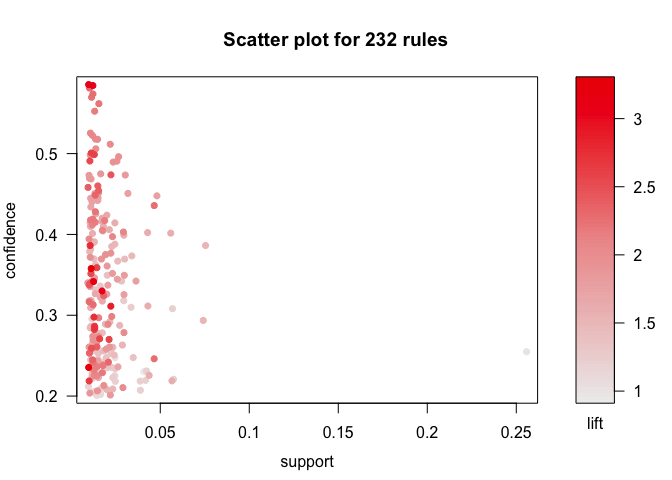
As you can see in the plot, most of the high lift rules have quite low
wupports and only give a .25 &gt; .4 confidence that the new item will
be bought.

Inspecting rules
----------------

What we see is that our most impactful rule associations predict mostly
vegetables. In the top 15, 11 rules predict vegetables. Most of the
vegetables are predicted by different types of vegetables, and fruits.
That makes sense. Any competent grocery store already has vegetables and
fruits near each other. One of the more interesting rules at the top of
lift are beef indicates root vegetables are 3 times more likely to be
purchased.

    inspect(sort(foodrules, by = "lift")[1:50, ])

         lhs                     rhs                     support confidence     lift
    [1]  {citrus fruit,                                                             
          other vegetables}   => {root vegetables}    0.01037112  0.3591549 3.295045
    [2]  {other vegetables,                                                         
          yogurt}             => {whipped/sour cream} 0.01016777  0.2341920 3.267062
    [3]  {other vegetables,                                                         
          tropical fruit}     => {root vegetables}    0.01230300  0.3427762 3.144780
    [4]  {beef}               => {root vegetables}    0.01738688  0.3313953 3.040367
    [5]  {citrus fruit,                                                             
          root vegetables}    => {other vegetables}   0.01037112  0.5862069 3.029608
    [6]  {root vegetables,                                                          
          tropical fruit}     => {other vegetables}   0.01230300  0.5845411 3.020999
    [7]  {other vegetables,                                                         
          whole milk}         => {root vegetables}    0.02318251  0.3097826 2.842082
    [8]  {curd,                                                                     
          whole milk}         => {yogurt}             0.01006609  0.3852140 2.761356
    [9]  {other vegetables,                                                         
          yogurt}             => {root vegetables}    0.01291307  0.2974239 2.728698
    [10] {other vegetables,                                                         
          yogurt}             => {tropical fruit}     0.01230300  0.2833724 2.700550
    [11] {other vegetables,                                                         
          root vegetables}    => {citrus fruit}       0.01037112  0.2188841 2.644626
    [12] {other vegetables,                                                         
          rolls/buns}         => {root vegetables}    0.01220132  0.2863962 2.627525
    [13] {tropical fruit,                                                           
          whole milk}         => {root vegetables}    0.01199797  0.2836538 2.602365
    [14] {rolls/buns,                                                               
          root vegetables}    => {other vegetables}   0.01220132  0.5020921 2.594890
    [15] {root vegetables,                                                          
          yogurt}             => {other vegetables}   0.01291307  0.5000000 2.584078
    [16] {whole milk,                                                               
          yogurt}             => {tropical fruit}     0.01514997  0.2704174 2.577089
    [17] {pip fruit}          => {tropical fruit}     0.02043721  0.2701613 2.574648
    [18] {tropical fruit,                                                           
          whole milk}         => {yogurt}             0.01514997  0.3581731 2.567516
    [19] {whipped/sour cream,                                                       
          yogurt}             => {other vegetables}   0.01016777  0.4901961 2.533410
    [20] {other vegetables,                                                         
          whipped/sour cream} => {yogurt}             0.01016777  0.3521127 2.524073
    [21] {other vegetables,                                                         
          root vegetables}    => {tropical fruit}     0.01230300  0.2596567 2.474538
    [22] {other vegetables,                                                         
          tropical fruit}     => {yogurt}             0.01230300  0.3427762 2.457146
    [23] {root vegetables,                                                          
          whole milk}         => {other vegetables}   0.02318251  0.4740125 2.449770
    [24] {whipped/sour cream,                                                       
          whole milk}         => {yogurt}             0.01087951  0.3375394 2.419607
    [25] {citrus fruit,                                                             
          whole milk}         => {yogurt}             0.01026945  0.3366667 2.413350
    [26] {whole milk,                                                               
          yogurt}             => {root vegetables}    0.01453991  0.2595281 2.381025
    [27] {onions}             => {other vegetables}   0.01423488  0.4590164 2.372268
    [28] {pork,                                                                     
          whole milk}         => {other vegetables}   0.01016777  0.4587156 2.370714
    [29] {whipped/sour cream,                                                       
          whole milk}         => {other vegetables}   0.01464159  0.4542587 2.347679
    [30] {root vegetables,                                                          
          whole milk}         => {tropical fruit}     0.01199797  0.2453222 2.337931
    [31] {chicken}            => {root vegetables}    0.01087951  0.2535545 2.326221
    [32] {curd}               => {yogurt}             0.01728521  0.3244275 2.325615
    [33] {pip fruit,                                                                
          whole milk}         => {other vegetables}   0.01352313  0.4493243 2.322178
    [34] {citrus fruit}       => {tropical fruit}     0.01992883  0.2407862 2.294702
    [35] {berries}            => {yogurt}             0.01057448  0.3180428 2.279848
    [36] {curd,                                                                     
          yogurt}             => {whole milk}         0.01006609  0.5823529 2.279125
    [37] {root vegetables}    => {other vegetables}   0.04738180  0.4347015 2.246605
    [38] {other vegetables}   => {root vegetables}    0.04738180  0.2448765 2.246605
    [39] {butter,                                                                   
          other vegetables}   => {whole milk}         0.01148958  0.5736041 2.244885
    [40] {cream cheese}       => {yogurt}             0.01240468  0.3128205 2.242412
    [41] {root vegetables,                                                          
          tropical fruit}     => {whole milk}         0.01199797  0.5700483 2.230969
    [42] {frozen vegetables}  => {root vegetables}    0.01159126  0.2410148 2.211176
    [43] {citrus fruit,                                                             
          whole milk}         => {other vegetables}   0.01301474  0.4266667 2.205080
    [44] {root vegetables,                                                          
          yogurt}             => {whole milk}         0.01453991  0.5629921 2.203354
    [45] {whipped/sour cream} => {root vegetables}    0.01708185  0.2382979 2.186250
    [46] {other vegetables,                                                         
          whole milk}         => {tropical fruit}     0.01708185  0.2282609 2.175335
    [47] {tropical fruit,                                                           
          yogurt}             => {other vegetables}   0.01230300  0.4201389 2.171343
    [48] {pork}               => {root vegetables}    0.01362481  0.2363316 2.168210
    [49] {domestic eggs,                                                            
          other vegetables}   => {whole milk}         0.01230300  0.5525114 2.162336
    [50] {chicken}            => {other vegetables}   0.01789527  0.4170616 2.155439

Most Common Items
-----------------

    itemFrequencyPlot(foodtrans, topN = 10)

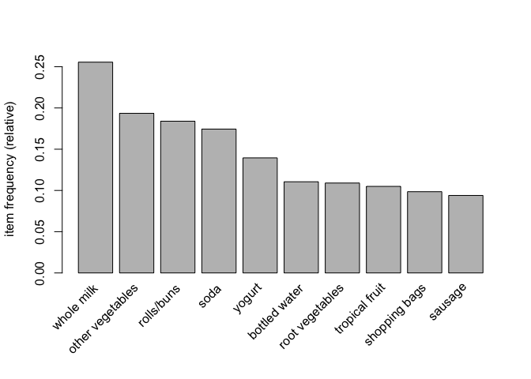

From the plot we can see the most common items in the transaction list.
This will be our baseline when determining how other items affect sales.

Setting up subgroups
--------------------

    andRoot <- subset(foodtrans, items %in% "root vegetables")
    andVeg <- subset(foodtrans, items %in% "other vegetables")
    andSoda <- subset(foodtrans, items %in% "soda")

Vegetables and Soda's Effect on Other Items
-------------------------------------------

With these graphs we can see what the 10 most common items are given
that Root Vegetables, Other Vegetables, or Soda are in the basket.
Surprisingly, if people buy soda they are less likely to buy milk, but
milk is still the most common thing for them to buy. The lift for soda
is also pretty interesting because it shows just what items are really
related and not partially related but also popular. Root Vegetables seem
to lift up herbs and rice a lot more than the rule associations we saw
previously would suggest, and other vegetables life up a significantly
different set of products despite being so closely related to each other
based on the rules we saw before.

    itemFrequencyPlot(andRoot, topN = 11, population = foodtrans, xlab = "Root Vegetables")

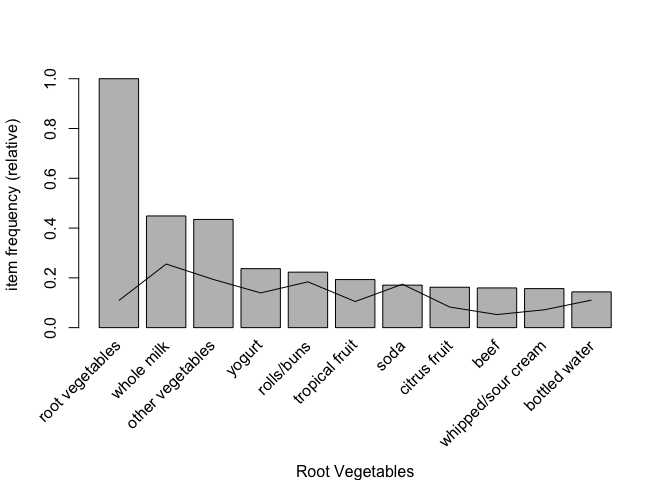

    itemFrequencyPlot(andRoot, topN = 11, population = foodtrans, lift = TRUE, xlab = "Root Vegetables")

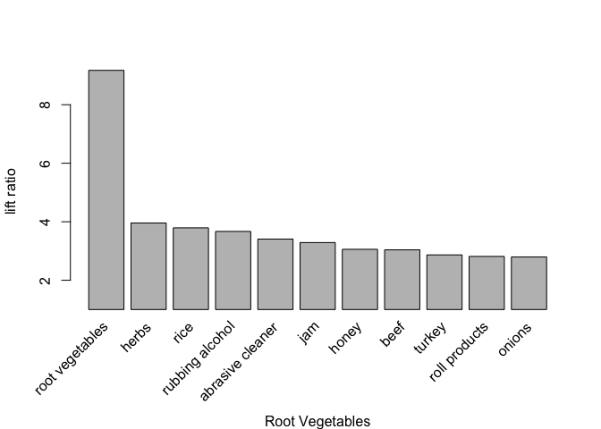

    itemFrequencyPlot(andVeg, topN = 11, population = foodtrans, xlab = "Other Vegetables")

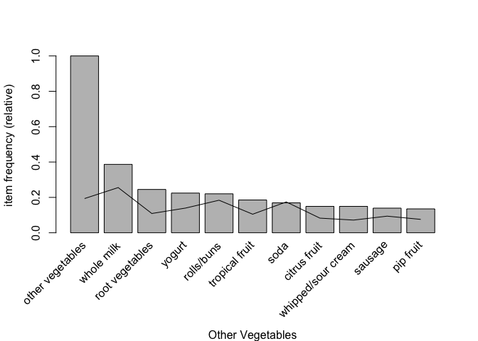

    itemFrequencyPlot(andVeg, topN = 11, population = foodtrans, lift = TRUE, xlab = "Other Vegetables")

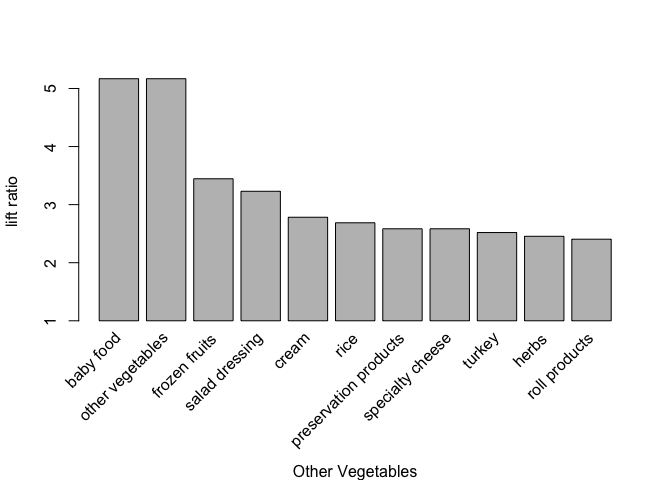

    itemFrequencyPlot(andSoda, topN = 11, population = foodtrans, xlab = "Soda")

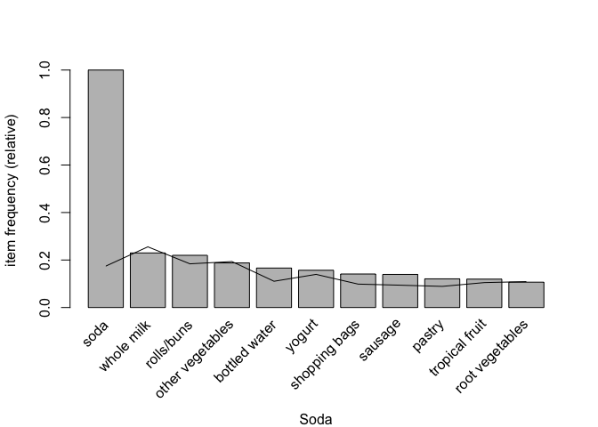

    itemFrequencyPlot(andSoda, topN = 11, population = foodtrans, lift = TRUE, xlab = "Soda")

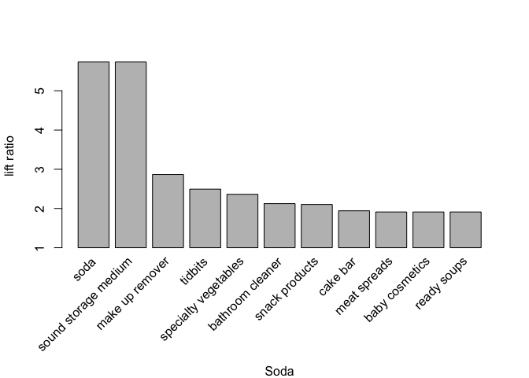

.
